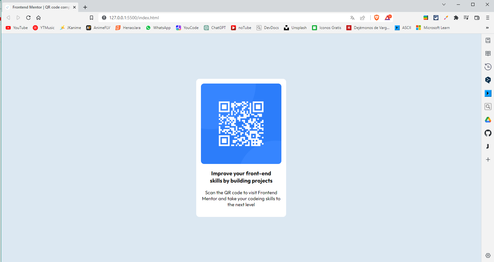

# Frontend Mentor - QR code component solution

This is a solution to the [QR code component challenge on Frontend Mentor](https://www.frontendmentor.io/challenges/qr-code-component-iux_sIO_H). Frontend Mentor challenges help you improve your coding skills by building realistic projects. 

## Table of contents

- [Overview](#overview)
  - [Screenshot](#screenshot)
  - [Links](#links)
- [My process](#my-process)
  - [Built with](#built-with)
  - [Continued development](#continued-development)
- [Author](#author)

## Overview

### Screenshot

### Links

- Solution URL: [Add solution URL here](https://your-solution-url.com)
- Live Site URL: [Add live site URL here](https://your-live-site-url.com)

## My process

### Built with

- HTML5
- CSS

### Continued development

After developing this project I was curious to learn more about the BEM methodology of css and also to learn tailwind css.

## Author
- Frontend Mentor - [@DeLSalGuz98](https://www.frontendmentor.io/profile/DeLSalGuz98)
- Linkedin - [Denilson Salas G](https://www.linkedin.com/in/denilson-sg/)

